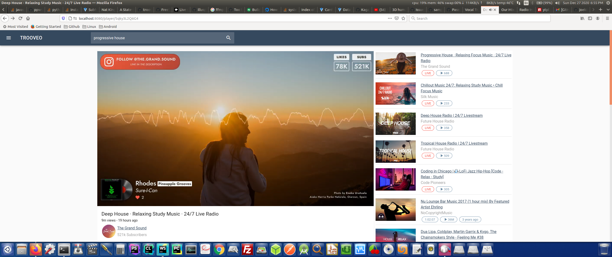
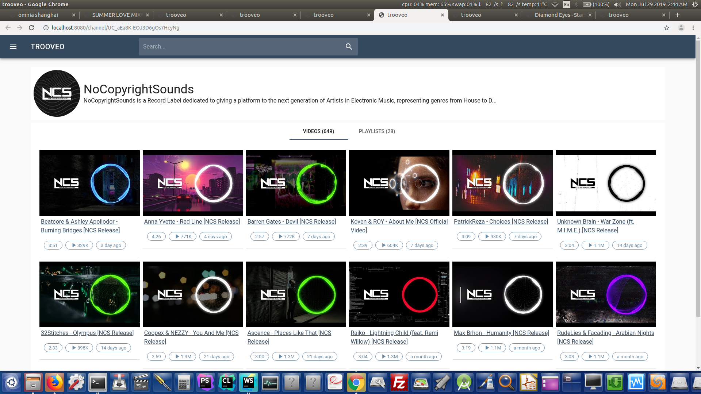
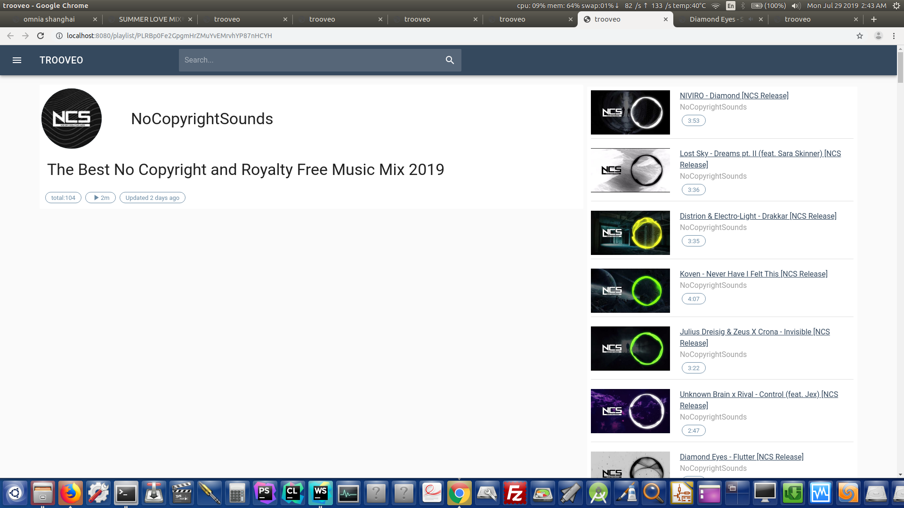
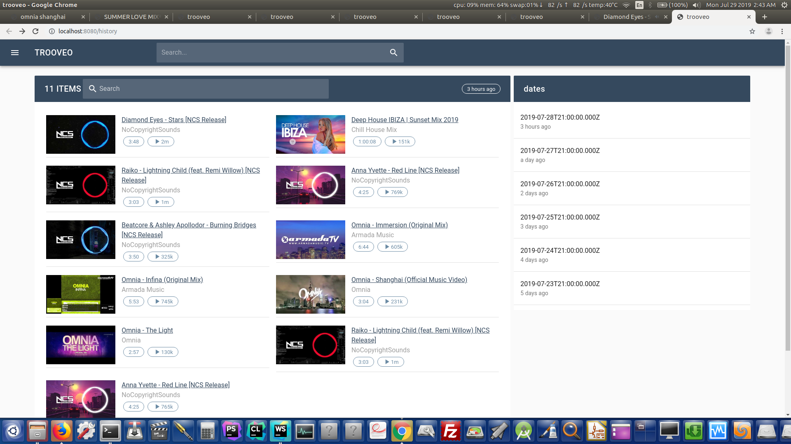
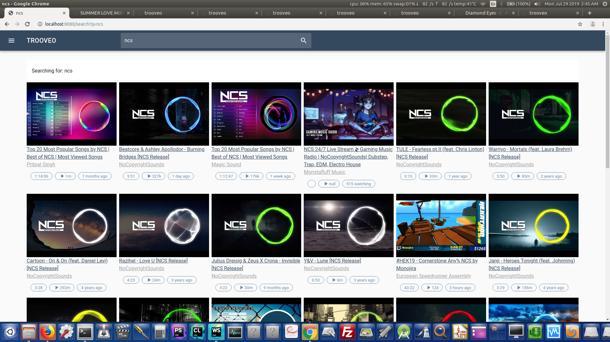

# Trooveo is a project which can let you search, listen to youtube videos.
# Player:



#Channel:



#playlist:



#history:



#search:


This is the front-end of the project, based on Vuejs, Vuetify.
It is connected to a [back-end server](https://github.com/joek85/YouMusic/tree/master) and fetches data accordingly, there is lots of features that are implemented but not enabled, like history, channels, sets etc...
Download is implemented but disabled, you can hover on the top left image in the player page to see the download button.
It looks similar to Youtube web page but for audio.

## Features
```
* Search
* fetch channel videos and playlists
* list history of played videos (require sql database for the backend server)
* keyboard events (left arrow will do forward for 5s, right arrow the same)
* fetch video infos and related videos
```
and many yet to come.
Let's improve it by contribution.
Enjoy.

### Compiles and hot-reloads for development
```
npm run serve
```

### Compiles and minifies for production
```
npm run build
```
